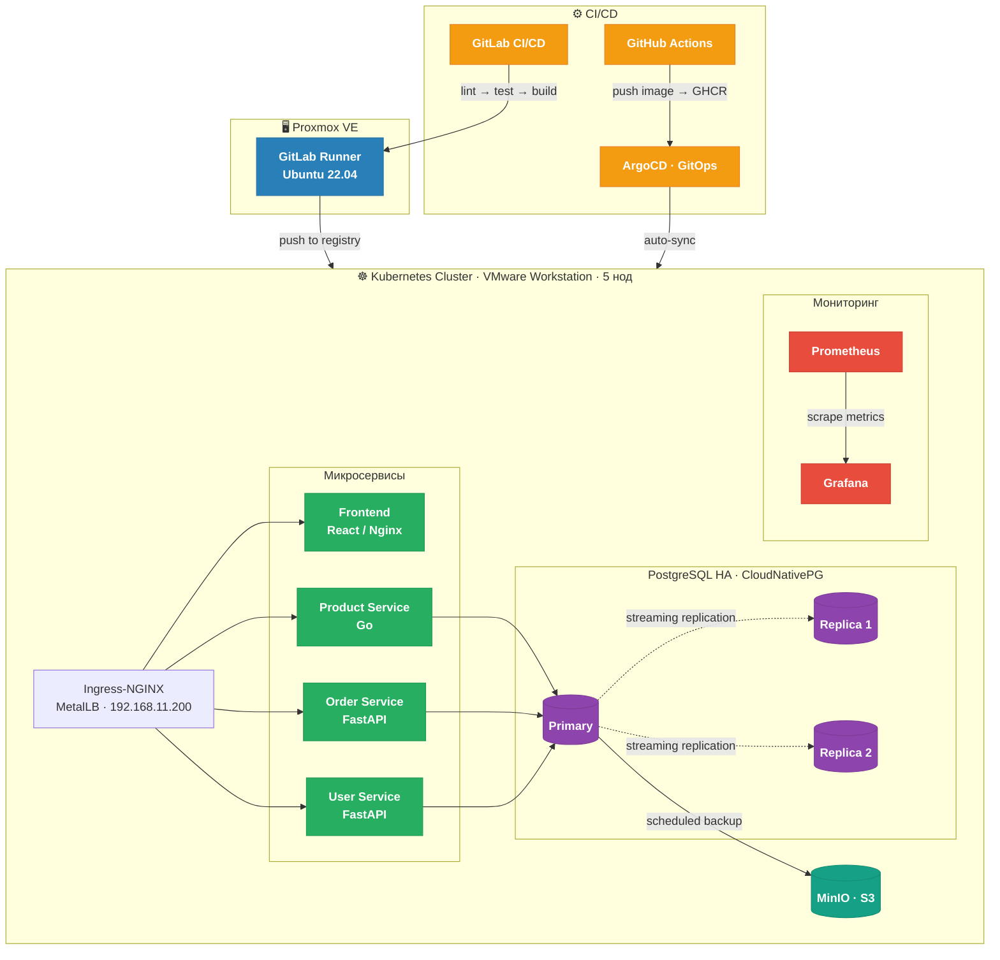
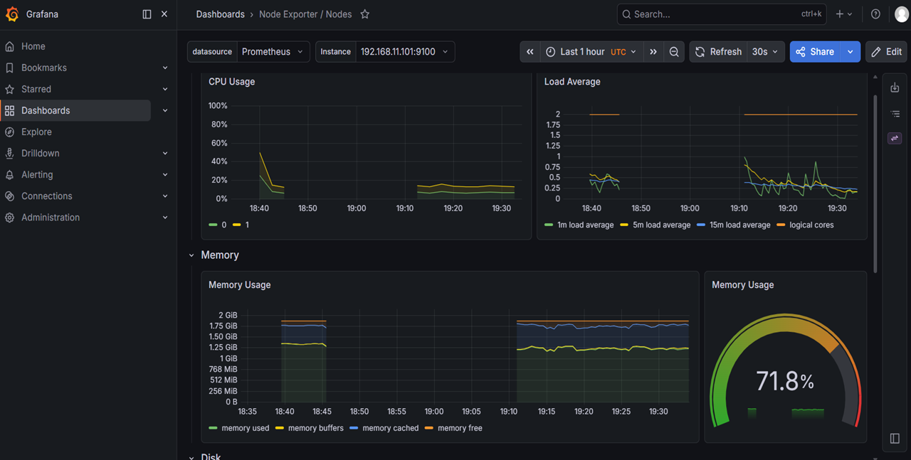
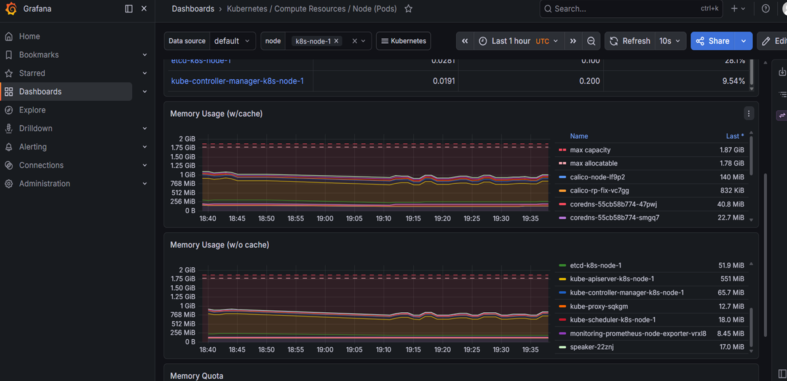
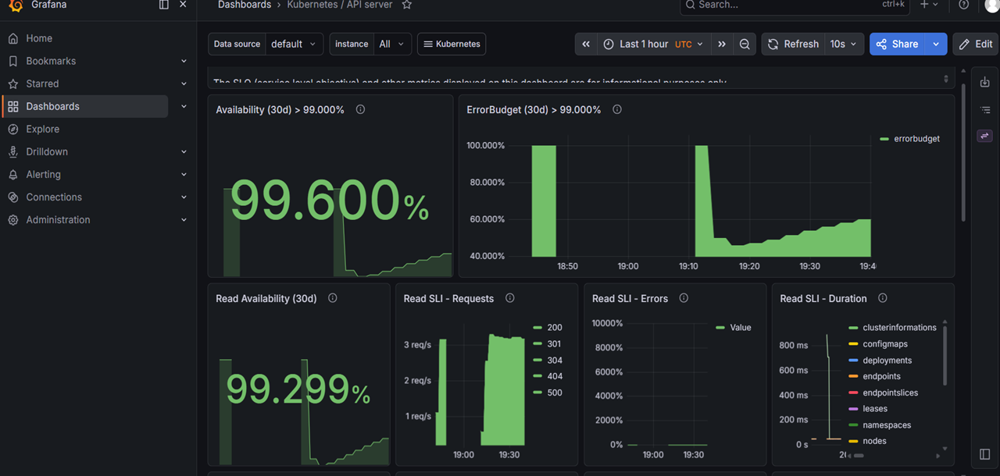
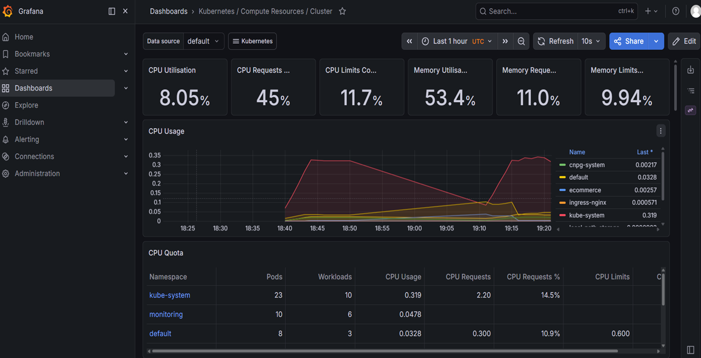

# ☸️ cloud-shop — DevOps Pet Project

Production-ready Kubernetes инфраструктура для e-commerce приложения из 4 микросервисов.  
Построена с нуля за 4 месяца — 11 последовательных фаз: от Docker до HA кластера с GitOps, мониторингом и безопасностью.


---

## Архитектура



---

## Стек технологий

| Категория | Технологии |
|-----------|-----------|
| Контейнеризация | Docker, Docker Compose |
| Оркестрация | Kubernetes (kubeadm), Helm |
| CI/CD | GitHub Actions, GitLab CI/CD, ArgoCD |
| IaC | Terraform, Ansible |
| Мониторинг | Prometheus, Grafana |
| Сеть | Calico (CNI), MetalLB, Ingress-NGINX |
| Базы данных | PostgreSQL (CloudNativePG), MinIO (S3) |
| Безопасность | Trivy |
| Гипервизоры | VMware Workstation, Proxmox VE |

---

## Фазы проекта

| # | Фаза | Технологии | Статус |
|---|------|-----------|--------|
| 1 | Docker Compose | Docker, Docker Compose | ✅ |
| 2 | Kubernetes | kubeadm, Helm, Ingress-NGINX | ✅ |
| 3 | CI/CD | GitHub Actions, ArgoCD (GitOps) | ✅ |
| 4 | Мониторинг | Prometheus, Grafana | ✅ |
| 5 | IaC | Terraform, Ansible | ✅ |
| 6 | Безопасность | Trivy (сканирование CVE в pipeline) | ✅ |
| 7 | Высокая доступность | HPA, PDB | ✅ |
| 8 | Базы данных | CloudNativePG, MinIO | ✅ |
| 9 | Production Deploy | VMware Workstation, kubeadm (5 нод) | ✅ |
| 10 | CNI Migration | Flannel → Calico v3.29.3 | ✅ |
| 11 | GitLab CI/CD | GitLab CE, GitLab Runner | ✅ |

---

## CI/CD Pipeline

```
push → lint (flake8) → test (pytest + coverage) → build (Docker) → push (Registry) → deploy (ArgoCD)
```

- **GitHub Actions** — сборка и пуш образов в GHCR при изменении кода сервисов
- **ArgoCD** — GitOps: следит за репозиторием, автоматически синхронизирует кластер
- **GitLab CI** — полный pipeline: lint → test → build → push в Container Registry

---

## Быстрый старт

**Локально через Docker Compose:**
```bash
cd phase-1-docker
docker compose up --build
# Frontend: http://localhost:3000
```

**Kubernetes через Helm:**
```bash
helm install cloud-shop phase-3-helm/ecommerce/
kubectl get pods -A
```

---

## Мониторинг — Grafana дашборды

| Кластер | Node Exporter |
|---------|--------------|
|  |  |

| CPU Usage | Dashboards |
|-----------|------------|
|  |  |

---

## Инфраструктура

| Компонент | Детали |
|-----------|--------|
| Кластер | 5 VM на VMware Workstation (Ubuntu 22.04, kubeadm) |
| Адреса нод | 192.168.11.101–105 (master + 4 workers) |
| Ingress IP | 192.168.11.200 (MetalLB v0.14.9) |
| CNI | Calico v3.29.3 — IPIP mode, pod CIDR 10.244.0.0/16 |
| PostgreSQL | CloudNativePG v1.23.0 — 1 primary + 2 replica |
| Автомасштабирование | HPA: min=3, max=10, CPU threshold=50% |
| Отказоустойчивость | PDB: minAvailable=2 |
| GitLab Runner | Proxmox VE VM (Ubuntu 22.04) |
| VPS | 64.188.79.192 — Nginx, Certbot SSL, Fail2ban, UFW |

